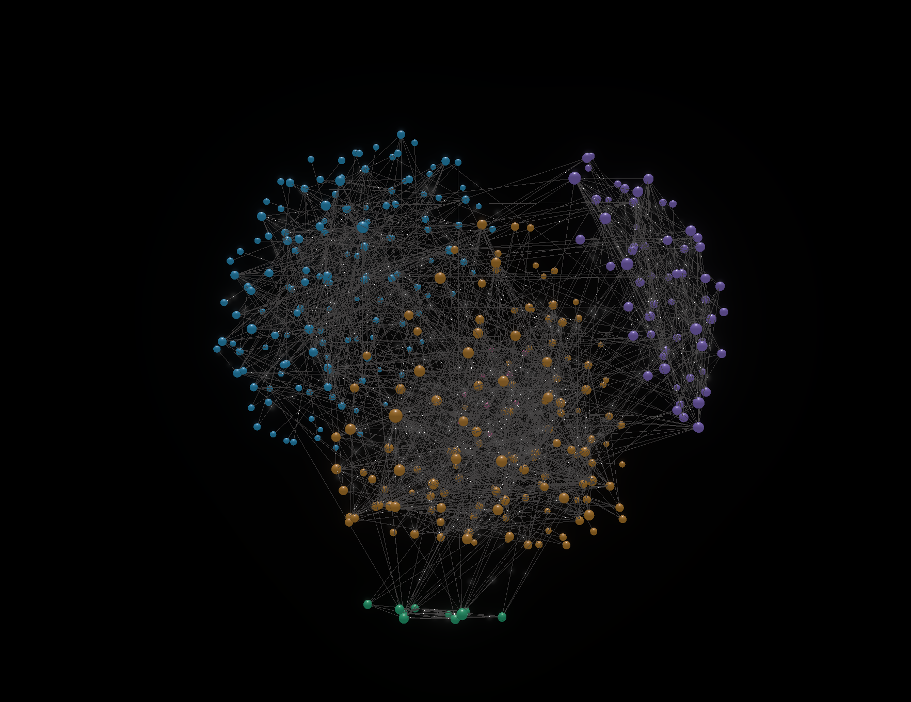
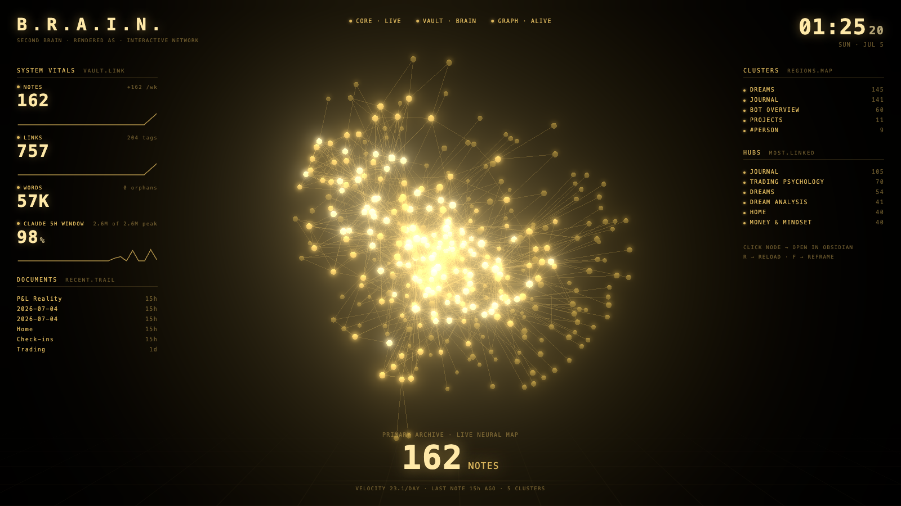

# 3D Pinnable Graph

**Your Obsidian vault as a glowing 3D brain — where connected notes form their own regions, and you can pin any note exactly where you want it.**

[](https://github.com/ajaydhamanda/obsidian-3d-pinnable-graph/releases/latest)
[](LICENSE)
[](https://obsidian.md)

Most graph views show you a hairball. This one shows you a **brain**: community detection groups notes and tags that share hubs, a cluster-gravity force condenses each group into its own colored region, and a sphere-shell force keeps the whole thing in a clean spherical silhouette. Bloom glow, glossy spheres, and hover focus make it something you actually want to leave open on a second monitor.



And the part no other graph plugin does: **pin nodes in 3D space**. Click a note to freeze it exactly where it is; everything else keeps moving elastically around it. Build a spatial map of your vault that stays put — pins survive restarts and follow notes when you rename them.

---

## Features

- 📌 **Pinnable nodes** — click to pin/unpin, drag to place; pins persist and follow renames
- 🧠 **Cluster regions** — notes and topics that share hubs condense into their own colored areas
- 🌐 **Sphere silhouette** — the graph always forms a clean ball, whatever the physics settings
- ✨ **Cinematic rendering** — bloom glow, glossy clearcoat spheres, cluster-tinted links, hover focus that spotlights a note and its connections
- 🏷️ **Smart labels** — label only your best-connected hub notes (or all, or on hover)
- 🎛️ **In-view settings panel** — every option in a floating glass panel inside the graph; changes apply live
- 🔄 **Live vault sync** — reacts to creates, deletes, renames, and new links without re-scrambling your layout
- 🔭 **Scope control** — exclude folders, hide orphans, show tags as nodes
- 🖥️ **Bonus: V.A.U.L.T.** — a standalone sci-fi HUD dashboard of your vault ([see below](#vault--a-sci-fi-hud-for-your-vault))

---

## Installation

### Option 1 — Community plugins (easiest, once accepted)

1. In Obsidian, open **Settings → Community plugins**
2. If you see **Turn on community plugins**, click it (this leaves Restricted mode)
3. Click **Browse**, search for **"3D Pinnable Graph"**
4. Click **Install**, then **Enable**

> ⏳ Not in the directory yet? The plugin is under review. Use Option 2 or 3 below in the meantime — they're just as good.

### Option 2 — BRAT (recommended until then; auto-updates)

1. Install the **BRAT** plugin: Settings → Community plugins → Browse → search "BRAT" → Install → Enable
2. Open **Settings → BRAT**
3. Click **Add Beta Plugin** and paste:
   ```
   ajaydhamanda/obsidian-3d-pinnable-graph
   ```
4. Click **Add Plugin** — BRAT installs it and keeps it updated with every release
5. Make sure **3D Pinnable Graph** is enabled under Settings → Community plugins

### Option 3 — Manual install

1. Download these three files from the [latest release](https://github.com/ajaydhamanda/obsidian-3d-pinnable-graph/releases/latest):
   `main.js` · `manifest.json` · `styles.css`
2. In your vault, create the folder:
   ```
   <your vault>/.obsidian/plugins/3d-pinnable-graph/
   ```
   (The `.obsidian` folder is hidden — press `Cmd/Ctrl+Shift+.` in your file manager to show hidden files.)
3. Move the three downloaded files into that folder
4. Restart Obsidian (or reload with `Ctrl/Cmd+R`)
5. Enable **3D Pinnable Graph** under **Settings → Community plugins → Installed plugins**

---

## Quick start

Open the graph via the **atom icon** in the left ribbon, or `Ctrl/Cmd+P` → **"Open graph"**.

| Action | Effect |
| --- | --- |
| **Left-click** a node | Pin it in place (click again to unpin) |
| **Drag** a node | Move it — it pins where you drop it |
| **Right-click** a node | Open that note in a new tab |
| **Hover** a node | Spotlight it and its direct connections |
| Scroll / drag background | Zoom and orbit the camera |
| **⛶ button** (top right) | Fit the whole graph in view |
| **⚙ button** (top right) | Open the in-view settings panel |

Commands (`Ctrl/Cmd+P`): **Open graph** · **Fit graph to view** · **Unpin all nodes** · **Export graph image** (saves a PNG of the current view into your vault)

> 💡 **Tip:** if your graph ever looks stretched toward one lonely far-away point, you probably drag-pinned a node by accident. One click on it (or "Unpin all") fixes it.

---

## Settings guide

Everything below lives in both the in-view panel (⚙) and Settings → 3D Pinnable Graph.

| Group | What you control |
| --- | --- |
| **Forces** | Node size, link strength/distance, repulsion, central pull, **cluster gravity** (how strongly regions condense), **sphere shell** (how strictly the ball shape is enforced) |
| **Colors** | Background, node/link/pin colors, link opacity, color mode — **by cluster** (default), by folder, or single color |
| **Effects** | **Glow** toggle + intensity, **node brightness**, glossy/matte finish, hover focus |
| **Labels** | Hubs only (default) / all notes / on hover · size · color |
| **Link flow particles** | Animated dots that show link direction |
| **Camera** | Auto-rotate + speed |
| **Scope** | Excluded folders, orphans, tags-as-nodes |
| **Pins** | Count + unpin all |

---

## V.A.U.L.T. — a sci-fi HUD for your vault

The repo includes a standalone companion app in [`vault-hud/`](vault-hud/): a gold, JARVIS-style dashboard that renders your vault as a glowing particle brain floating in space, framed by live panels — note/link/word counts with sparklines, cluster regions, top hubs, recently edited notes, a live clock, and (if you use Claude Code) a token-usage gauge read from your local session data.



It runs entirely on your machine and reads your vault straight from disk — Obsidian doesn't even need to be open. Clicking any node opens that note in Obsidian.

**Setup** (requires [Node.js](https://nodejs.org) 18+):

```bash
git clone https://github.com/ajaydhamanda/obsidian-3d-pinnable-graph.git
cd obsidian-3d-pinnable-graph
npm install
echo "/absolute/path/to/your/vault" > .vault-path
npm run vault
```

Then open **http://localhost:3000**. Keys: `R` reloads the graph, `F` reframes the camera. (You can also set the vault path with the `OBSIDIAN_VAULT` environment variable instead of `.vault-path`.)

---

## Development

```bash
git clone https://github.com/ajaydhamanda/obsidian-3d-pinnable-graph.git
cd obsidian-3d-pinnable-graph
npm install
npm run dev     # watch build
npm run build   # type-check + production build
```

`npm run deploy` builds and copies the plugin into the vault named by `OBSIDIAN_VAULT` or `.vault-path`. Releases: `npm version patch && git push --follow-tags` — the GitHub workflow builds and drafts the release automatically.

## Support

Found a bug or have an idea? [Open an issue](https://github.com/ajaydhamanda/obsidian-3d-pinnable-graph/issues).

## License

[MIT](LICENSE) © Ajay Dhamanda
